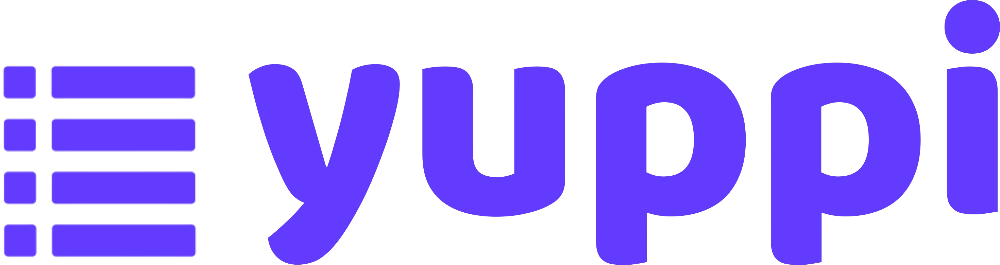

[String]: https://developer.mozilla.org/en-US/docs/Web/JavaScript/Reference/Global_Objects/String
[Number]: https://developer.mozilla.org/en-US/docs/Web/JavaScript/Reference/Global_Objects/Number
[Boolean]: https://developer.mozilla.org/en-US/docs/Web/JavaScript/Reference/Global_Objects/Boolean
[Object]: https://developer.mozilla.org/en-US/docs/Web/JavaScript/Reference/Global_Objects/Object
[Date]: https://developer.mozilla.org/en-US/docs/Web/JavaScript/Reference/Global_Objects/Date
[Buffer]: https://developer.mozilla.org/en-US/docs/Web/JavaScript/Reference/Global_Objects/ArrayBuffer
[Promise]: https://developer.mozilla.org/en-US/docs/Web/JavaScript/Reference/Global_Objects/Promise
[Void]: https://developer.mozilla.org/en-US/docs/Web/JavaScript/Reference/Global_Objects/Undefined
[Null]: https://developer.mozilla.org/en-US/docs/Web/JavaScript/Reference/Operators/null
[Undefined]: https://developer.mozilla.org/en-US/docs/Web/JavaScript/Reference/Global_Objects/Undefined

<!---->

[Domain]: ./src/patterns/Domain.pattern.ts
[Email]: ./src/patterns/Email.pattern.ts
[HTTP]: ./src/patterns/HTTP.pattern.ts
[PhoneNumber]: ./src/patterns/PhoneNumber.pattern.ts
[URI]: ./src/patterns/URI.pattern.ts
[Username]: ./src/patterns/Username.pattern.ts
[YuppiOptionsDefault]: ./src/defaults/YuppiOptions.default.ts
[AnyObject]: ./src/types/AnyObject.type.ts
[JSONSchema]: ./src/types/JSONSchema.type.ts
[Schema]: ./src/types/Schema.type.ts
[ValidationError]: ./src/types/ValidationError.type.ts
[YuppiOptions]: ./src/types/YuppiOptions.type.ts

<div align="center">
  <br/>
  
  <br/>
  <br/>
  
  
  
  
</div>

## Contents

- [About](#about)
- [Features](#features)
- [Installation](#installation)
- [Documentation](#documentation)
  - [Tree](#tree)
  - [Import](#import)
  - [Constructors](#constructors)
  - [Methods](#methods)
  - [Patterns](#patterns)
  - [Types](#types)
- [Links](#links)
  - [Discord](https://discord.gg/keift)
  - [Telegram](https://t.me/keiftt)
  - [Twitter](https://x.com/keiftttt)
  - [GitHub](https://github.com/keift)
- [License](#license)

## About

Portable and simple schemas for property validation.

## Features

- Easy and understandable schema
- Contains ready regex patterns
- Portable schemas as a JSON file
- Works with [Yup](https://npmjs.com/package/yup), stable and secure
- Schemas can be declared for TypeScript
- It has union support, properties can have multiple types
- Error messages are ready to be understood but can be edited if desired
- Can be converted to Yup and [JSON Schema](https://json-schema.org). JSON Schema is OpenAPI compatible

## Installation

You can install it as follows.

```shell
# NPM
npm add yuppi

# PNPM
pnpm add yuppi

# Yarn
yarn add yuppi

# Bun
bun add yuppi

# Deno
deno add yuppi
```

## Documentation

### Tree

Briefly as follows.

```typescript
yuppi
│
├── new Yuppi(options?)
│   │
│   ├── validate(schema, properties)
│   ├── declare(schema, name)
│   ├── convertToYup(schema)
│   └── convertToJSONSchema(schema)
│
├── Patterns
│   │
│   ├── Domain
│   ├── Email
│   ├── HTTP
│   ├── PhoneNumber
│   ├── URI
│   └── Username
│
├── type AnyObject
├── type JSONSchema
├── type Schema
├── type ValidationError
└── type YuppiOptions
```

### Import

Briefly as follows.

```typescript
import { Yuppi, Patterns } from 'yuppi';
```

### Constructors

`new Yuppi(options?)`

Yuppi schema builder.

> | Parameter | Type           | Default               | Description            |
> | --------- | -------------- | --------------------- | ---------------------- |
> | options?  | [YuppiOptions] | [YuppiOptionsDefault] | Constructor's options. |
>
> Example:
>
> ```typescript
> const Yupp = new Yuppi();
> ```

### Methods

`Yuppi.validate(schema, properties)`

Validate the properties with your Yuppi schema.

> | Parameter  | Type        | Default | Description                |
> | ---------- | ----------- | ------- | -------------------------- |
> | schema     | [Schema]    |         | Yuppi schema.              |
> | properties | [AnyObject] |         | Properties to be validate. |
>
> returns [Promise]<[AnyObject]>
>
> Example:
>
> ```typescript
> const schema: Schema = {
>   display_name: {
>     type: 'string',
>     max: 32,
>     nullable: false,
>     required: true
>   },
>
>   username: {
>     type: 'string',
>     min: 3,
>     max: 16,
>     pattern: Patterns.Username,
>     nullable: false,
>     required: true
>   },
>
>   email: {
>     type: 'string',
>     pattern: Patterns.Email,
>     lowercase: true,
>     nullable: false,
>     required: true
>   },
>
>   permissions: [
>     {
>       type: 'string',
>       enum: ['*'],
>       nullable: false,
>       required: true
>     },
>     {
>       type: 'array',
>       items: {
>         type: 'string',
>         enum: ['read', 'write'],
>         nullable: false,
>         required: true
>       },
>       nullable: false,
>       required: true
>     }
>   ]
> };
>
> const properties = {
>   display_name: 'Fırat',
>   username: 'fir4tozden',
>   email: 'fir4tozden@gmail.com',
>   permissions: '*'
> };
>
> try {
>   await Yupp.validate(schema, properties);
>   /*
>     {
>       display_name: "Fırat",
>       username: "fir4tozden",
>       email: "fir4tozden@gmail.com",
>       permissions: "*"
>     }
>   */
> } catch (error) {
>   const errors = (error as ValidationError).errors;
>
>   console.log(errors[0]); // "Field email must match the required pattern ^[a-zA-Z0-9._-]+@([a-zA-Z0-9-]+\\.)+[a-zA-Z]{2,}$"
> }
> ```

<br/>

`Yuppi.declare(schema, name)`

Declare your Yuppi schema for TypeScript.

> | Parameter | Type     | Default | Description       |
> | --------- | -------- | ------- | ----------------- |
> | schema    | [Schema] |         | Yuppi schema.     |
> | name      | [String] |         | Declaration name. |
>
> returns [Promise]<[Void]>
>
> Example:
>
> ```typescript
> import type { User } from './generated/yuppi/types/User';
>
> await Yupp.declare(schema, 'User');
>
> const user = (await Yupp.validate(schema, properties)) as User;
> /*
>   interface User {
>     display_name: string;
>     username: string;
>     email: string;
>     permissions: "*" | ("read" | "write")[];
>   }
> */
> ```

<br/>

`Yuppi.convertToYup(schema)`

Convert your Yuppi schema into Yup schema.

> | Parameter | Type     | Default | Description   |
> | --------- | -------- | ------- | ------------- |
> | schema    | [Schema] |         | Yuppi schema. |
>
> returns [AnyObject]
>
> Example:
>
> ```typescript
> Yupp.convertToYup(schema);
> ```

<br/>

`Yuppi.convertToJSONSchema(schema)`

Convert your Yuppi schema into [JSON Schema](https://json-schema.org).

> | Parameter | Type     | Default | Description   |
> | --------- | -------- | ------- | ------------- |
> | schema    | [Schema] |         | Yuppi schema. |
>
> returns [JSONSchema]
>
> Example:
>
> ```typescript
> Yupp.convertToJSONSchema(schema);
> /*
>   {
>     type: "object",
>     properties: {
>       display_name: {
>         type: "string",
>         maxLength: 32
>       },
>       username: {
>         type: "string",
>         minLength: 3,
>         maxLength: 16,
>         pattern: "^(?=.*[a-zA-Z])[a-zA-Z0-9][a-zA-Z0-9_]*$"
>       },
>       email: {
>         type: "string",
>         pattern: "^[a-zA-Z0-9._-]+@([a-zA-Z0-9-]+\\.)+[a-zA-Z]{2,}$"
>       },
>       permissions: {
>         anyOf: [
>           {
>             type: "string",
>             enum: ["*"]
>           },
>           {
>             type: "array",
>             items: {
>               type: "string",
>               enum: ["read", "write"]
>             }
>           }
>         ]
>       }
>     },
>     required: ["display_name", "username", "email", "permissions"],
>     additionalProperties: false
>   };
> */
> ```

### Patterns

| Pattern       | Description                    | Examples                                                                         |
| ------------- | ------------------------------ | -------------------------------------------------------------------------------- |
| [Domain]      | Domains.                       | `"google.com"` ✅<br/>`"www.google.com"` ✅<br/>`"https://google.com"` ❌        |
| [Email]       | Emails.                        | `"fir4tozden@gmail.com"` ✅<br/>`"fir4tozden+2@gmail.com"` ❌                    |
| [HTTP]        | HTTP only links.               | `"https://google.com"` ✅<br/>`"http://google.com"` ✅<br/>`"google.com"` ❌     |
| [PhoneNumber] | Country code and phone number. | `"0090-555555555"` ✅<br/>`"90-5555555555"` ❌                                   |
| [URI]         | Protocol free links.           | `"mongodb://mongodb.net"` ✅<br/>`"https://google.com"` ✅<br/>`"google.com"` ❌ |
| [Username]    | Usernames like Twitter.        | `"fir4tozden"` ✅<br/>`"Fir4tozden"` ✅<br/>`"fir4t ozden"` ❌                   |

### Types

| Type              |
| ----------------- |
| [AnyObject]       |
| [JSONSchema]      |
| [Schema]          |
| [ValidationError] |
| [YuppiOptions]    |

## Links

- [Discord](https://discord.gg/keift)
- [Telegram](https://t.me/keiftt)
- [Twitter](https://x.com/keiftttt)
- [GitHub](https://github.com/keift)

## License

MIT License

Copyright (c) 2025 Keift

Permission is hereby granted, free of charge, to any person obtaining a copy of this software and associated documentation files (the "Software"), to deal in the Software without restriction, including without limitation the rights to use, copy, modify, merge, publish, distribute, sublicense, and/or sell copies of the Software, and to permit persons to whom the Software is furnished to do so, subject to the following conditions:

The above copyright notice and this permission notice shall be included in all copies or substantial portions of the Software.

THE SOFTWARE IS PROVIDED "AS IS", WITHOUT WARRANTY OF ANY KIND, EXPRESS OR IMPLIED, INCLUDING BUT NOT LIMITED TO THE WARRANTIES OF MERCHANTABILITY, FITNESS FOR A PARTICULAR PURPOSE AND NONINFRINGEMENT. IN NO EVENT SHALL THE AUTHORS OR COPYRIGHT HOLDERS BE LIABLE FOR ANY CLAIM, DAMAGES OR OTHER LIABILITY, WHETHER IN AN ACTION OF CONTRACT, TORT OR OTHERWISE, ARISING FROM, OUT OF OR IN CONNECTION WITH THE SOFTWARE OR THE USE OR OTHER DEALINGS IN THE SOFTWARE.
